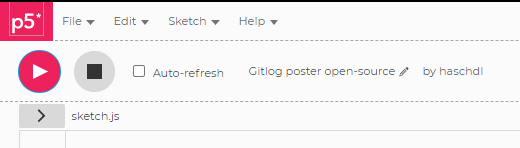

# Make an AWESOME poster out of your git logs

How to make your own poster from your git logs. Use this exercise to have fun, and perhaps as a way to increase 
data and programming literacy in your teams. The output is definitely something to be print and put up on the walls!

Presented at the Data Innovation Summit 2020 as part of the talk Data Engineering = Software Engineering.


## I don't have any tools, can I run it in my browser?


Yes! You can use the p5.js editor!

1. Start by browing the sample code here: https://editor.p5js.org/haschdl/sketches/LGhwnphKN

* Use the Play button to run the sketch. 

    

* See the output from the right side.
* Start tweaking the code for changes! Color, sizes etc. Break it until you like it :)

2. Now it is time to use your own data.  See Exporting Git logs.

3. When you're happy, righ-click the image, and save to your local computer. 
Add some text and make a beautiful poster for you team. See [gitlog_poster_example.svg](gitlog_poster_example.svg) as example.


## I have development tools installed in my computer, such as VS Code

1. Export your git logs to a CSV so that you have just two columns: Date, Number of Commits.
The name of the columns doesn't matter, but the code expects the date to be in the format YYYY-MM-DD.

2. Save the data to the file `/data/commits_per_day.csv`

3. Open index.html using a web-server. I use the add-on [Live-Server](https://marketplace.visualstudio.com/items?itemName=ritwickdey.LiveServer) and righ-click,  Open with Live Server.


## Exporting Git logs

To make a poster with your team's data, export your git logs to a CSV so that you have just two columns: Date, Number of Commits. The name of the columns doesn't matter, as long as date is the first column, and number of commits is in the second column. Check the sample file [commits_per_day.csv](/p5js/gitlogposter/data/commits_per_day.csv)

If you run Linux or Mac, the following `git log` command does 80% of the job. 

* In the command line, make sure you are at the repo folder. 
* Run the command below, then copy and paste to Excel to format the columns.  
    If you are more versed with scripting, you can probably do it all in the command line without having the manual steps. 

    ```Bash
    git log --date=short --pretty=format:%ad | sort | uniq -c
    ```

    If you run Windows, you can use the exact same command in the Git Bash.
* A few more tips to get you start  https://stackoverflow.com/questions/35769003/git-commit-count-a-day/48329147

## Taking to the next level

In this example we barely scratched the surface in terms of what data can be export of Git logs. With minor changes to the code, you can incorporate other attributes. You can also use an entirely different data set!

Suggestions to explore:

- Can I use different colors? What about shapes? 
- What if I add other elements, like lines and circles, in random places?

If you browse the code, you will notice calls to "push", "translate", "fill" and "rect". These are all p5.js calls, so if you need more information about their syntax, check https://p5js.org/reference/


Presented during Data Innovation Summit 2020.
